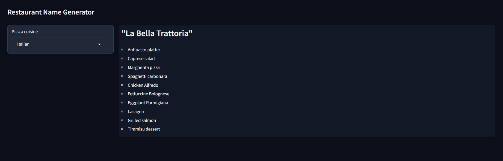

Check out the configuration reference at https://huggingface.co/docs/hub/spaces-config-reference

# Introduction

This repository contains the code for generating a restaurant name and menu items based on an input cuisine.
It makes use of [LangChain](http://www.langchain.com) and OpenAI's chatGPT API, along with [Gradio](http://gradio.app) to serve an application.

The original [LangChain Crash Course For Beginners tutorial](https://www.youtube.com/watch?v=nAmC7SoVLd8&list=PLeo1K3hjS3uu0N_0W6giDXzZIcB07Ng_F&ab_channel=codebasics) by [@codebasics](https://twitter.com/codebasicshub) used an older version of LangChain and Streamlit for the app.

The code here uses updated libraries and Gradio in place of Streamlit.

# Demo

You can play around with the demo app on [this Hugging Face Space](https://huggingface.co/spaces/chongdashu/langchain-crash-course-gradio)

# Acknowledgements

The code is based on original tutorial series by [@codebasics](https://twitter.com/codebasicshub).
